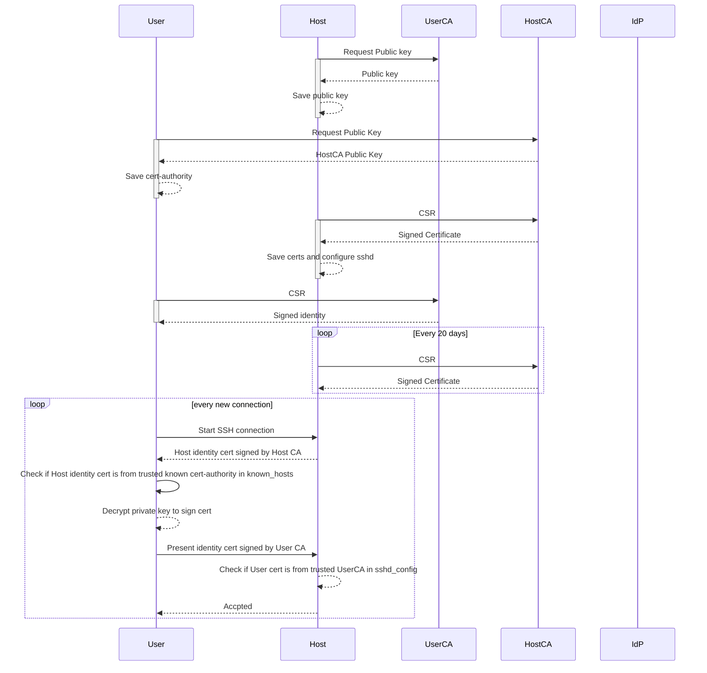
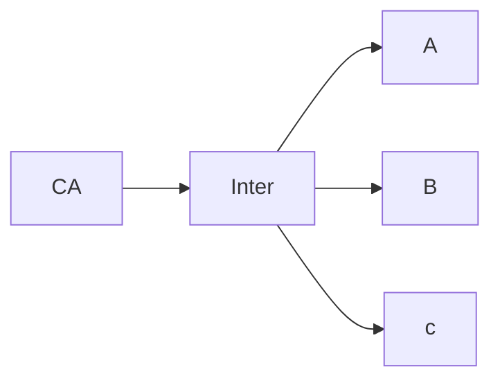
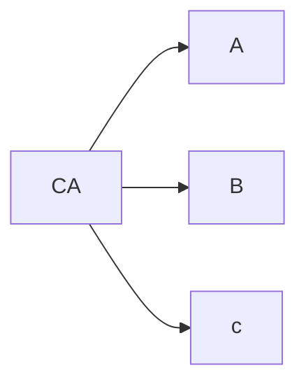
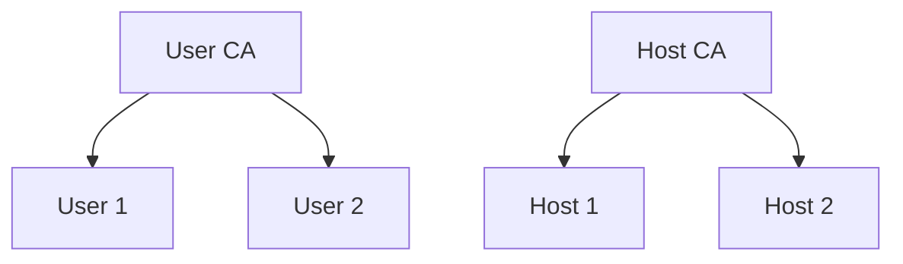

# secure_ssh

## What we are doing

We are creating the infrastructure to enable managed certificate based SSH logins. The approach can abstract user auth to an IdP and the certificate management to a CA. For this, we use the smallstep CA and keycloak as the IdP. 

## Why do we need certificate based SSH logins?

This is best explained by an analogy. 
Lets assume you want to travel to a country. How would you prove who you are to the border officer? 

You could have a 'secret' that only you know and was agreed with the officer before hand. That way the officer knows who you are and alls good right? 
Yeah, no. What if someone else was evesdropping on the secret and uses it with the officer? The officer has no choice but to let that person in under your name, and if that person does something illegal, you are on the hook for it. 
What if someone tries to guess it ? given enough tries, they could be successful ( or if they know your mothers maiden name ). 
What if the you write it down to not forget the secret and someone else sees it? 
Finally, it might work if you are one person, but the officer needs to handle thousands of travellers every day. Would he agree on secrets with all of them ?

This simple ( and a bit strained ) example is unfortunately one that most of us use in SSH. We set a username and password and use that to authenticate with the host. Password auth is not scalable to multi user, multi host setups. 
Password auth also suffers from the problem that it relies on the users keeping the passwords secure to verify both identity and authorization. 

Simple usernames and passwords are easy to work with and is what most of us daily drive for SSH. However, this is problematic when
1. The number of hosts is more than one. In this case we need to use a password manager or reuse the same username/password combo (a very bad idea!).
2. If you have more than one person managing the hosts. In this case, we could again use a shared password manager or reuse the same account (another bad idea).

So, we need a shared password manager with complex random passwords then? 

Not so fast. Lets assume we need to revoke someone's access. If they have been using a password maanger, they could theoreticaly just have dumped the plaintext password and use it without issues.
Ofcourse, sharing a password is absoltely a bad idea too! ( which is what a shared password manager is, albeit with some extra steps )

Okay, so username/password combos suck. How about an SSH keypair? 

Now we are talking. This approach is secure because each client has their own public/private keypair and the hosts can add the public key to their list of authorized_keys to trust the user. 
Revoking access is just as simple as editing the host's authorized_keys and removing the public key entry. 

But what happens when we want to maintain this for a 100 hosts? Or hosts that come up and go down quickly? 
The management overheads for this would mean that we need to maintain a database of known hosts, and users, mappings of the privileges, have a script/automation that updates authorized_keys on each host wth a cron job. Revoking is not instant as we need to wait for the cron job to trigger or alternatively to make this instant, we need to trigger an automation workflow on the host to remove the user's key. 

That is just way too much. 
What if, there was a database of all users and all hosts and everytime a user wants to connect, they get a certificate from the database and presents it to the host? 
Wouldnt it be cool if the host also provides some certs to prove its identity to the user so that we can overcome MiTM attacks ? or how about two databases, one for the user and one for the hosts so that the certs can be rotated indepently of each other ? 
Finally, why cant we just use the identity provider we already have for user authentication ? 

Enter, SSH certificates with Certificate authorities and Identity providers. We will be building the flow below. 



### Step 1: Install and provsion a CA. 
smallstep CA in docker steps here


For all steps below, there are step cli commands. You can either bootstrap step-cli on the host you are onboarding or you can use a trusted machine to handle the interface to the CA. 





### Step 2: Onboarding a host with the smallstep CA

Now that we have the step CA running, we need to understand what it does in the background that enables SSH. 

To begin with, starting step CA with SSH enabled creates two smaller CAs, a User CA and a Host CA. All users get their identity certificates from the User CA and the hosts get their identity certs from the Host CA. 



If you notice carefully, there is a problem here. Since the Users and the Hosts use two different CAs, how will they trust each other? As it stands, if User 1 tries to login to Host 2, the host has no way of verifying if the user is legitimate or is a malicious actor using a self signed cert. 

To overcome this, we first add the User CA's public key certificate to each of the hosts and establish a trust anchor. By doing this, the hosts will trust any usser certificates that is signed by the User CA. 


> [!WARNING]
> The steps below assume you are running step-cli on the hosts. If not, take a close look at what files the command creates/uses and copy them to the trusted machine that runs step-cli.

2.1 Download CA public key to host to establish trust

This step uses step-cli to query the User CA for its public key and puts it in a file.
```bash
step ssh config --roots > /etc/ssh/ssh_user_key.pub
```

2.2 Configure sshd to pick up user CA certs

```bash
cat <<EOF >> /etc/ssh/sshd_config
# This is the CA's public key for authenticating user certificates:
TrustedUserCAKeys /etc/ssh/ssh_user_key.pub
EOF
```

At this point, the host will trust all certs presented by users from the CA for access. However, the user has no way of knowing if the host is correct or not and will require us to manually accept the fingerprint of the server on connection. While this is okay for smaller deployments, this is not acceptable for largish deployments where one cannot assume that the host they connect to is truly the intended host or not. To overcome this, we use the Host CA on smallstep to asign a cert for the host to present on connection. 

2.3 Provision a host cert with the CA

In this step, we present the host's public key to the CA and sign it for the hostnam / domain / IP we request. 

> [!NOTE]
> If running this on another pc that isnt the host, copy /etc/ssh/ssh_host_ecdsa_key.pub to the machine with step cli


```bash
cd /etc/ssh
step ssh certificate --host --sign <HOSTNAME_OR_IP> ssh_host_ecdsa_key.pub
```

2.4 Enable host to present certs with sshd

Now that the host is assigned a cert, we need to configure sshd to present this when clients login for attesting identity. 

> [!NOTE]
> If you are running step-cli on another pc that isnt the host, copy ssh_host_ecdsa_key-cert.pub file to the host machine at /etc/ssh

```bash
cat <<EOF | sudo tee -a /etc/ssh/sshd_config

# This is our host private key and certificate:
HostKey /etc/ssh/ssh_host_ecdsa_key
HostCertificate /etc/ssh/ssh_host_ecdsa_key-cert.pub
EOF
```
2.5. Restart sshd and ssh

```bash
systemctl restart sshd
systemctl restart ssh
```

### Step 3 : Onboarding a User

Execute these on the **client** machine

3.1. Trust HostCA certs
```bash
echo "@cert-authority * $(step ssh config --host --roots)" >> ~/.ssh/known_hosts
```

3.2 Get User certs from UserCA and configure ssh agent
```bash
step ssh certificate alice@smallstep.com id_ecdsa
```

[1] https://smallstep.com/blog/diy-single-sign-on-for-ssh/
[2] https://smallstep.com/docs/tutorials/ssh-certificate-login/#configure-ssh-client-to-accept-host-certs
[3] https://smallstep.com/docs/step-ca/basic-certificate-authority-operations/
